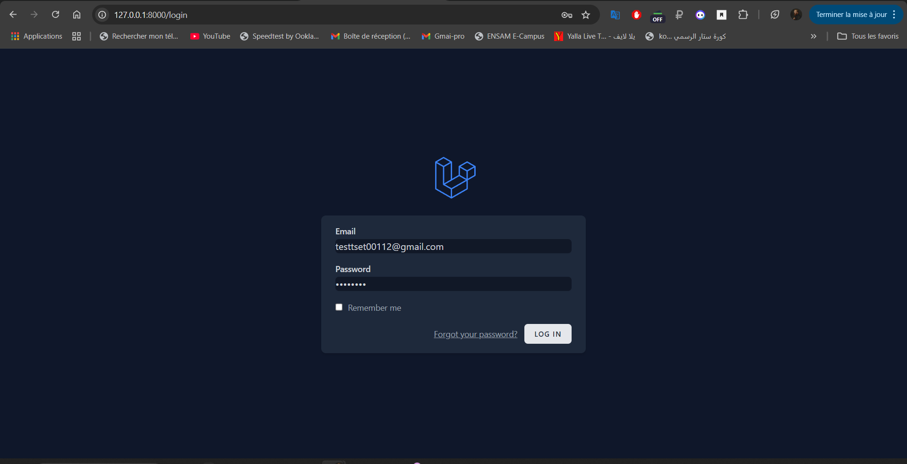
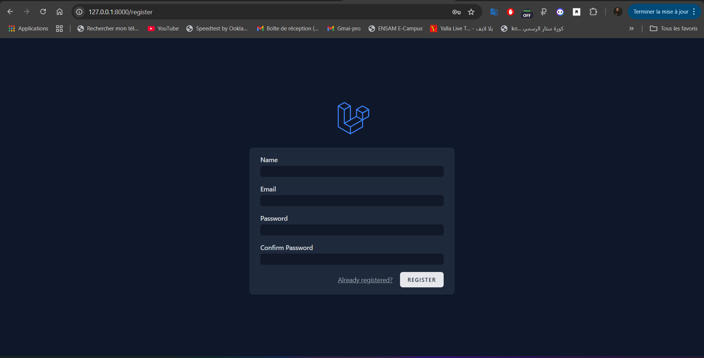
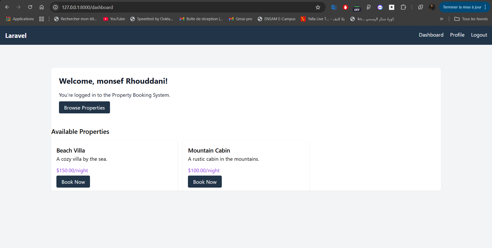
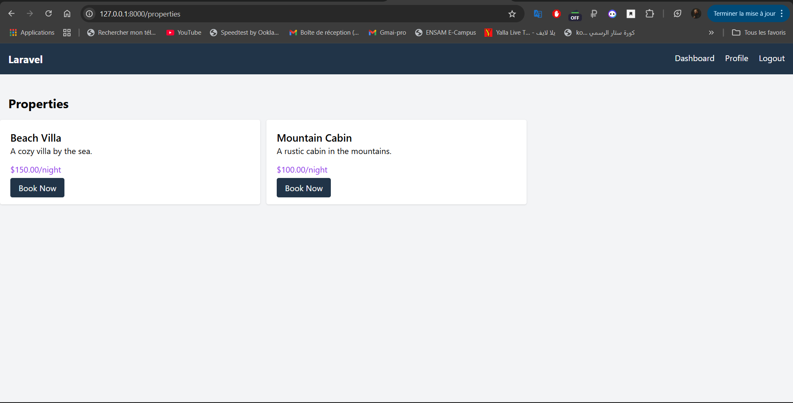
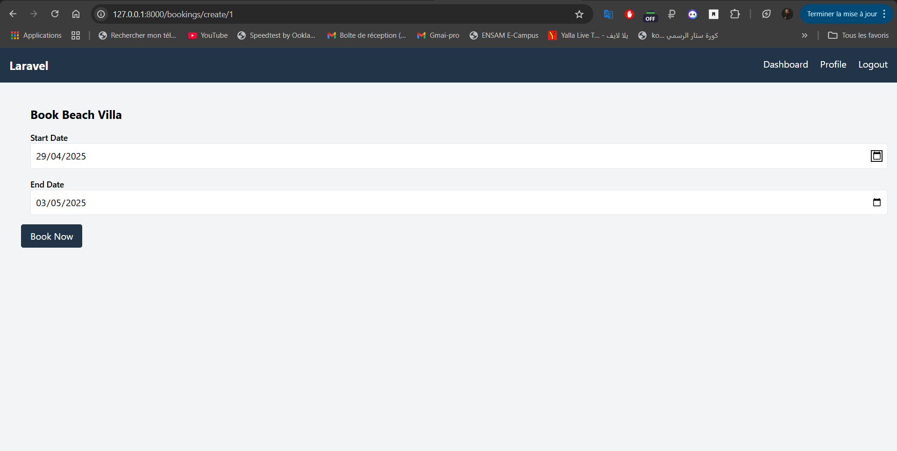

# Property Booking System

A Laravel application for booking properties, built with Breeze, Blade, TailwindCSS, Livewire, and Filament. This project was developed as part of a technical test for InnovQube to demonstrate proficiency in Laravel, Livewire, Filament, and TailwindCSS.

# Overview

This application allows users to:
- Register and log in using Laravel Breeze.
- Browse and book properties (e.g., Beach Villa, Mountain Cabin).
- Manage bookings dynamically using a Livewire component.
- Administer properties and bookings via a Filament admin panel.

# Requirements

- PHP >= 8.1
- Composer
- Node.js & NPM
- MySQL
- Git

# Installation

1. **Clone the Repository**:
 - git clone https://github.com/MonsefRH/innovQube-booking-management.git
 - cd innovQube-booking-management

2. **Install PHP Dependencies**:
   composer install

3. **Set Up Environment**:
 - Copy the `.env.example` file to `.env`:
 - cp .env.example .env
 - Configure your database in `.env` (using MySQL):
    DB_CONNECTION=mysql
    DB_HOST=127.0.0.1
    DB_PORT=3306
    DB_DATABASE=Project1
    DB_USERNAME=root
    DB_PASSWORD=your_password

4. **Generate Application Key**:
    php artisan key:generate

5. **Run Migrations**:
    php artisan migrate

6. **Set a some properties for Test** :
    php artisan db:seed

7. **Install Frontend Dependencies**:
   npm install && npm run dev

8. **Run the Application**:
   php artisan serve

---

- Access the app at `http://localhost:8000`.
  
# Project Structure

- **Models**:
- `app/Models/Property.php`: Represents properties (name, description, price_per_night).
- `app/Models/Booking.php`: Represents bookings (user_id, property_id, start_date, end_date).
- `app/Models/User.php`: User model with relationship to bookings.
- **Controllers**:
- `app/Http/Controllers/PropertyController.php`: Handles property listing and dashboard.
- `app/Http/Controllers/BookingController.php`: Handles booking creation.
- **Views**:
- `resources/views/layouts/app.blade.php`: Main layout with navigation bar.
- `resources/views/dashboard.blade.php`: Dashboard showing user info and properties.
- `resources/views/properties/index.blade.php`: Property listing page.
- `resources/views/bookings/create.blade.php`: Booking form using Livewire.
- **Livewire Component**:
- `app/Livewire/BookingManager.php`: Manages dynamic booking form.
- `resources/views/livewire/booking-manager.blade.php`: Livewire view for the booking form.
- **Filament Resources**:
- `app/Filament/Resources/PropertyResource.php`: Admin interface for properties.
- `app/Filament/Resources/BookingResource.php`: Admin interface for bookings.
- **Styling**:
- `tailwind.config.js`: Custom TailwindCSS colors (`primary: #1E40AF`, `secondary: #9333EA`).
- `resources/css/app.css`: TailwindCSS styles.

# Usage Instructions

1. **User Flow**:
- **Register/Login**: Visit `/register` or `/login` to create an account or log in.
  - See screenshots: [Login Page](screenshots/login.png), [Register Page](screenshots/register.png).
- **Dashboard**: After logging in, you’ll be redirected to `/dashboard`, where you can see a welcome message and a list of available properties.
  - See screenshot: [Dashboard](screenshots/dashboard.png).
- **Browse Properties**: Visit `/properties` to see all properties, or browse them directly from the dashboard.
  - See screenshot: [Property Listing](screenshots/properties.png).
- **Book a Property**: Click "Book Now" on a property to access the booking form. Enter start and end dates, then submit.
  - See screenshot: [Booking Form](screenshots/booking-form.png).

2. **Admin Flow**:
- **Access the Admin Panel**: Create a Filament admin user:
   php artisan make:filament-user

Follow the prompts to create a user (e.g., email: `admin@example.com`, password: `password`).
- Visit `/admin` and log in with the admin credentials.
- Manage properties and bookings (create, edit, delete).
- See screenshots: 

# Features

- **User Authentication**: Implemented with Laravel Breeze (login, register, logout, profile management).
- **Property Listing**: Display properties with Blade and TailwindCSS.
- **Booking Management**: Create bookings dynamically using a Livewire component (`BookingManager`).
- **Admin Panel**: Manage properties and bookings via Filament (`/admin`).
- **Styling**: Custom TailwindCSS colors (`primary`, `secondary`) applied throughout the app.

# Screenshots

- **Login Page**: 
- **Register Page**: 
- **Dashboard**: 
- **Property Listing**: 
- **Booking Form**: 
- **Filament Admin - Properties**:
- **Filament Admin - Bookings**: 
---

**Developed by MonsefRH**

